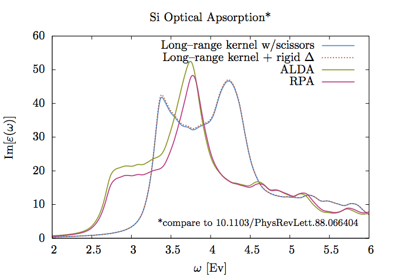

Tutorials for DP and EXC
=========================
This is the complete set of DP and EXC Tutorials offered by the European Theoretical Spectroscopy Facility [(ETSF)](http://www.etsf.eu). It covers the basics of the [DP](http://dp-code.org) and [EXC](http://etsf.polytechnique.fr/exc/) codes.

These tutorials and code were created and coordinated by [Matteo Gatti](mailto:matteo.gatti@polytechnique.edu), [Francesco Sottile](mailto:francesco.sottile@polytechnique.edu), and many others in the ETSF. They are owed many thanks for the all the help provided for these tutorials and for creating and maintaning such excellent code.

Introduction
------------------


From the website:

### DP
The DP code is an ab initio linear response TDDFT code implemented on a plane-wave basis set and NC pseudopotentials. It works in the frequency domain calculating in real space the basic quantities (the Kohn-Sham polarizability and the exchange-correlation kernel) and solving the fundamental TDDFT equations in reciprocal space. The approximations range from the most used RPA and TDLDA, to non-local (and/or non-adiabatic) kernels. Bulk systems are particularly well suited, but the code can be applied also to surfaces, 1D (tubes, wires) and 0D (clusters, molecules) systems.

Main purposes:

* Calculate EELS (Electron Energy-Loss Spectroscopy)
* IXSS (Inelastic X-ray Scattering Spectroscopy) at large transferred momentum Q
* Optical properties

### EXC
EXC is an ab initio Bethe-Salpeter Equation code working in reciprocal space, in the frequency domain, and using a plane-wave basis set. Its purpose is to calculate dielectric and optical properties, like

* optical absorption, reflectivity, refraction index
* EELS (Electron Energy-Loss Spectroscopy)
* IXSS (Inelastic X-ray Scattering Spectroscopy)

It can be used on a large variety of systems, ranging from bulk systems, surfaces, to clusters or atoms (using the supercell method). Full coupling (beyond Tamm-Dancoff approximation) calculations are possible, as well as the possibility to speed up using the Haydock iterative scheme.

Installation
-------------
You can get the DP/EXC combined source code directly from the ETSF. These instructions are for a particular cluster, *Medusa*, but they should be generally applicable to any computer. Please note that we use the Intel compilers like `ifort`, `icc`, `mpiifort`, and `mpiicc`.

### Requirements
To install and use the code, you will need the following software:

* A version of ABINIT (a version of ABINIT 5.7.3 debugged by [Matteo Gatti](mailto:matteo.gatti@polytechnique.edu) was used here) but most versions should work,
* the FFTW library (FFTW 3.3.4 used here),
* the LAPACK/BLAS Libraries (LAPACK 3.5.0 used here) or,
* an Intel® Math Kernel Library (MKL) installation. 

Individual configuration and installation notes follow.

#### ABINIT 5.7.3 (etsf):
First, we need to configure ABINIT for our particular system. For *Medusa* we configure with 
```bash
./configure --prefix=$HOME/bin FC=mpiifort CC=mpiicc CXX=icc --disable-all-plugins --enable-mpi MPI_RUNNER=mpiexec --enable-mpi-trace --enable-64bit-flags --enable-gw-dpc --host=x86_64 CFLAGS_EXTRA="-axSSE4.2 -ip"
```

followed by an optional `make clean`, and `make mj4`.

The binary is at `$HOME/bin/bin/abinip` which you can add to your PATH, but you can also add a handy alias like `abinit='$HOME/bin/bin/abinip'` to your `.bashrc`.

#### FFTW 3.3.4:
For *Medusa*, we configure our FFTW install with
```bash
./configure --prefix=$HOME/bin/fftw-3.3.4/ CC=icc
```

then the usual `make clean`, `make`, and optionally, `make install`.

#### LAPACK 3.5.0
The LAPACK install includes the approprate BLAS library.

On *Medusa*, we need to modify the make.inc file to use the appropriate C and FORTRAN compilers (icc and ifort) and uncomment the `TIMER = EXT_ETIME` line and comment the `TIMER = INT_ETIME` line in exchange. `make blaslib; make lapacklib` compiles the libraries in the same directory.

### DP 5.2.99-r1883:
You can compile by linking to an MKL installation or by compiling your own versions of the LAPACK+BLAS and FFTW libraries as described above. 

With these librarires properly compiled you can proceed to configure the DP build. On *Medusa* we can configure with the following options.

* For sequential use:
```bash
./configure --prefix=$HOME/bin CC=icc F90=ifort F90FLAGS="-O3" LDFLAGS=-nofor_main --with-fftw3=/home/sma/src/fftw-3.3.4/ --with-blas="-L/home/sma/src/lapack-3.5.0/ -lrefblas"
```

* for parallel use with MPI:
```bash
./configure --prefix=$HOME/bin MPI_F90=mpiifort MPI_CC=mpiicc CC=icc F90=ifort F90FLAGS="-O3" LDFLAGS=-nofor_main --with-fftw3=/home/sma/src/fftw-3.3.4/ --with-blas="-L/home/sma/src/lapack-3.5.0/ -lrefblas" --enable-mpi
```

* for parallel use with OpenMP:
```bash
./configure --prefix=$HOME/bin CC=icc --with-blas="-L/home/sma/src/lapack-3.5.0/ -lrefblas" --with-fftw3=/home/sma/src/fftw-3.3.4/ F90=ifort F90FLAGS="-O3 -g -pg -openmp" LDFLAGS=-nofor_main  --enable-openmp
```

* and for [Intel® MKL](https://software.intel.com/en-us/articles/intel-mkl-link-line-advisor):
```bash
./configure --prefix=$HOME/bin CC=icc F90=ifort F90FLAGS="-O3 -i8 -I/opt/intel/composer_xe_2011_sp1.6.233/mkl/include" LDFLAGS=-nofor_main --with-fftw3=/home/sma/src/fftw-3.3.4/ --with-blas="-Wl,--start-group /opt/intel/composer_xe_2011_sp1.6.233/mkl/lib/intel64/libmkl_intel_ilp64.a /opt/intel/composer_xe_2011_sp1.6.233/mkl/lib/intel64/libmkl_core.a /opt/intel/composer_xe_2011_sp1.6.233/mkl/lib/intel64/libmkl_sequential.a -Wl,--end-group -lpthread -lm" --with-lapack="-Wl,--start-group /opt/intel/composer_xe_2011_sp1.6.233/mkl/lib/intel64/libmkl_intel_ilp64.a /opt/intel/composer_xe_2011_sp1.6.233/mkl/lib/intel64/libmkl_core.a /opt/intel/composer_xe_2011_sp1.6.233/mkl/lib/intel64/libmkl_sequential.a -Wl,--end-group -lpthread -lm"
```

Lastly, `make clean`, `make`, and optionally `make install`. Binaries are located in `dpforexc/src/dp-5.3.99*`. You can add this to your PATH or make handy aliases like
```bash
alias dp="$HOME/bin/bin/dp"
alias dpmpi="$HOME/bin/bin/dp-5.3.99-mpi"
alias dpopenmp="$HOME/bin/bin/dp-5.3.99-openmp"
alias broad="$HOME/bin/bin/broad"
```

To run the tests, you need to run `export F_UFMTENDIAN=big` to account for the endianness of the system. You can then run the tests with `make test` from the base directory, or just `make` in the `tests/` directory.

Running in Parallel
--------------------
Note that running with MPI across more nodes is better for some cases (diagonalization of the Hamiltonian, or others that benefit from parallelization), while using OpenMP on one node with many cores is better in other cases (excitonic calculations, or others that benefit from running entirely in RAM). You need to select the best method and tailor it to suit your calculation.

An MPD ring needs to be open before running in parallel on *Medusa* using MPI. This can be done for one node by running
```bash
mpdboot -v -r ssh -f NODE -n 1
```

The MPD ring needs to be closed after the calculation by executing `mpdallexit`.

### ABINIT in Parallel
Running ABINIT in parallel can be done once the ring is open. For example,
```bash
mpiexec -np 12 -env I_MPI_DEVICE rdssm  /home/sma/abinit-5.7.3_etsf/src/main/abinip < input.files > output.log
```

allows you to run on 12 cores using MPI. You don't need to explicitely state the full path to the binary if it is in your PATH.

For the last part of the ABINIT GW tutorial, running on 12 cores takes 432.3 seconds running on one core, 109.7 seconds running in on ten cores and 125.2 seconds running on four. Calculation speed does not increase linearly with the number of cores or processors.

### Running DP in parallel
We can run DP/EXC in parallel via MPI,
```bash
mpiexec -np 12 -env I_MPI_DEVICE rdssm  /home/sma/dpforexc/src/dp-5.3.99-mpi -i input.in -k kss_file.kss

```

or OpenMP,
```bash
ulimit -s unlimited
export OMP_STACKSIZE=1G
export OMP_NUM_THREADS=12
dp-openmp -i input.in -k kss_file.kss
```

The first part of the DP Tutorial takes 20.64 seconds in sequential mode, 6.24 seconds using MPI, and 6.41 seconds using OpenMP.

As I understand it, DP works fastest when running with OpenMP. When diagonalizing the Hamiltonian with the iterative Haydock scheme, OpenMP is also faster. Constructing the Hamiltonian with excitonic effects will be faster using MPI. OpenMP (with `export OMP_STACKSIZE=1M`) and you can calculate the memory usage with
```
(12x12x4x8x12)^2*8/1024
(kpts * Nv * Nc)^2 * Bytes / 1024^(GB,MB,KB)
```

Nero install instructions
---------------------------

### For abinit-5.7.3_etsf:

1. `SetEnv ifort2011`
2. `./configure --disable-all-plugins --enable-mpi FC=mpif90 CC=mpicc`
3. `make clean`
4. `make mj4`

### For dp-5.2.99-r1883:

1. `SetEnv ifort2011`
2. Configure dp with the following options:
```bash
./configure F90=ifort F90FLAGS=-O2 LDFLAGS=-nofor_main --with-fftw3=/share/apps/env_ifort2011_openmpi --with-blas="-L/share/apps/env_ifort2011_openmpi/lib -lblas" --with-lapack="-L/share/apps/env_ifort2011_openmpi/lib -llapack" CC=icc
```
3. `make`
4. `make test`
5. `make install`
